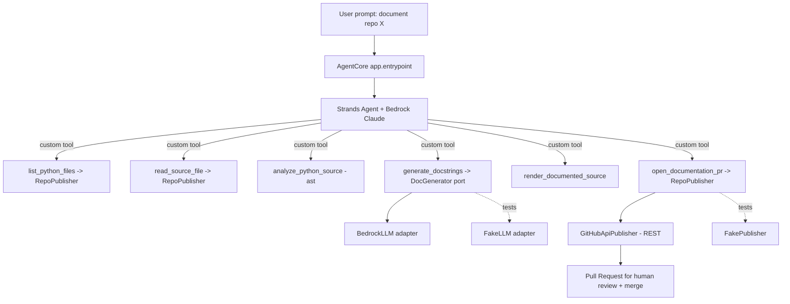

# Design — Documentation Agent

## Overview

The Documentation Agent is a layered/hexagonal Python package under `src/docagent`.
A Strands `Agent`, hosted by the Amazon Bedrock AgentCore SDK, orchestrates a set of
custom `@tool`s. All GitHub access goes through the **GitHub REST API** behind a
`RepoPublisher` port, so there is no MCP dependency.

The agent reads source from GitHub (fully remote, via REST), detects missing
docstrings via `ast`, generates docstrings with a Claude model on Bedrock, renders
the documented source, then creates a branch, commits, and opens a Pull Request for
human review. README generation and drift detection are added later as additional
`@tool`s with no change to existing tools or the GitHub adapter.

## Research findings (real APIs this design targets)

- **AgentCore Runtime**: `BedrockAgentCoreApp()` + async `@app.entrypoint` handler
  receiving a JSON payload (`{"prompt": str}`) over `POST /invocations`; `app.run()`
  serves it. Deploy via the `agentcore` CLI (`configure` → `launch`). The handler
  must validate `prompt` is a string before use.
- **Strands**: `Agent(model=<bedrock-model-id>, tools=[...], system_prompt=...)`
  runs the tool-calling loop against Bedrock. Custom tools are `@tool`-decorated
  functions whose docstring + type hints become the tool schema. Return structured
  results; a dict without a `status` key is treated as success, so set
  `{"status": "error"}` explicitly on failure.
- **GitHub REST API** (base `https://api.github.com`), auth
  `Authorization: Bearer <PAT>`, `Accept: application/vnd.github+json`. Endpoints
  used:
  - `GET /repos/{owner}/{repo}/git/trees/{ref}?recursive=1` — discover files.
  - `GET /repos/{owner}/{repo}/contents/{path}?ref={ref}` — read a file (base64).
  - `GET /repos/{owner}/{repo}/git/ref/heads/{branch}` — resolve base SHA.
  - `POST /repos/{owner}/{repo}/git/refs` — create a branch.
  - `PUT /repos/{owner}/{repo}/contents/{path}` — create/update a file (commit).
  - `POST /repos/{owner}/{repo}/pulls` — open the pull request.

## Architecture



## Package layout

```
src/docagent/
  domain/
    models.py        # DocKind, DocTarget, DocProposal, AnalysisReport (frozen dataclasses)
    analyzer.py      # ast scan -> AnalysisReport (missing docstrings + signatures)
    rendering.py     # insert docstrings at correct indentation; build PR title/body/branch
  ports/
    llm.py           # DocGenerator protocol: generate_docstring(target) -> Result[str, DomainError]
    repo.py          # RepoPublisher protocol + value objects (RepoFile, PullRequest, FileChange)
  adapters/
    bedrock_llm.py   # Strands/Bedrock-backed DocGenerator (prompt building + model call)
    fake_llm.py      # deterministic fake for offline tests
    github_api.py    # GitHubApiPublisher: RepoPublisher over the GitHub REST API
    fake_repo.py     # FakePublisher: in-memory RepoPublisher for offline tests
  tools/
    docstring_tools.py  # @tool: analyze_python_source, generate_docstrings, render_documented_source
    repo_tools.py       # @tool: list_python_files, read_source_file, open_documentation_pr
    # future: readme_tools.py, drift_tools.py (same pattern)
  agent.py         # build_agent(generator, publisher, settings) -> Strands Agent
  app.py           # BedrockAgentCoreApp + @app.entrypoint (deploy target)
  main.py          # local CLI entry (hkt-docagent)
  config/settings.py  # model id, region, repo owner/name, base branch, PAT env var, one_pr_per_run
tests/docagent/    # pytest mirrors structure; fake LLM + fake publisher, no network/AWS
```

## Components and interfaces

### Domain models (`domain/models.py`)

Frozen dataclasses, `from __future__ import annotations`:

- `DocKind(Enum)` — `MODULE`, `CLASS`, `FUNCTION`.
- `DocTarget` — `qualified_name`, `kind`, `signature`, `source_snippet`,
  `start_line`, `end_line`, `file_path`.
- `DocProposal` — `target: DocTarget`, `docstring: str`.
- `AnalysisReport` — `file_path: str`, `targets: tuple[DocTarget, ...]`, plus counts.

### Analyzer (`domain/analyzer.py`)

- `analyze_source(source: str, file_path: str) -> Result[AnalysisReport, DomainError]`
  walks the AST for module/class/function nodes, flags those with no docstring, and
  captures signature/snippet/line range. Invalid source returns `err(...)`.

### Rendering (`domain/rendering.py`)

- `render_documented_source(source: str, proposals) -> Result[str, DomainError]`
  inserts each docstring at the correct indentation; output must re-parse via `ast`.
- `build_pr(report, proposals) -> (branch_name, title, body)` produces a unique-ish
  branch name (e.g. `docagent/docstrings-<short-hash>`) and a body listing symbols.

### LLM port + adapters

- `ports/llm.py` — `DocGenerator` protocol:
  `generate_docstring(target: DocTarget) -> Result[str, DomainError]`.
- `adapters/fake_llm.py` — deterministic PEP 257-style docstrings (offline tests).
- `adapters/bedrock_llm.py` — Strands/Bedrock-backed generator; a pure
  prompt-builder function turns a `DocTarget` into the model prompt.

### Repository port + adapters (`ports/repo.py`, `adapters/`)

- `ports/repo.py` — `RepoPublisher` protocol plus small frozen value objects:
  - `list_python_files(ref) -> Result[tuple[str, ...], DomainError]`
  - `read_file(path, ref) -> Result[RepoFile, DomainError]`
  - `open_pull_request(branch, base, title, body, changes) -> Result[PullRequest, DomainError]`
    where `changes` is a sequence of `FileChange(path, content)`. The adapter is
    responsible for resolving the base SHA, creating the branch, committing each
    file change, and opening the PR — the domain/tools never touch HTTP directly.
- `adapters/github_api.py` — `GitHubApiPublisher` implements `RepoPublisher` over
  the GitHub REST API using the stdlib (`urllib.request`) so there is no extra
  runtime dependency. Reads the PAT from the configured env var. Never writes to the
  base branch.
- `adapters/fake_repo.py` — `FakePublisher` records calls and returns canned values
  (including a deterministic fake PR URL) so the whole flow is unit-testable offline.

### Custom tools (`tools/`)

Strands `@tool` functions with rich docstrings (they become the schemas), each
returning structured `{"status": "success"|"error", ...}` and never raising:

- `tools/docstring_tools.py`: `analyze_python_source(path, source)`,
  `generate_docstrings(path, source)`, `render_documented_source(path, source)`.
- `tools/repo_tools.py`: `list_python_files()`, `read_source_file(path)`,
  `open_documentation_pr(title, body, branch, changes)`.

`DocGenerator` and `RepoPublisher` are injected via class-based tool holders so the
fake and real implementations are interchangeable.

### Agent (`agent.py`)

- `build_agent(generator, publisher, settings) -> Agent` constructs
  `Agent(model=<bedrock model id>, tools=[list_python_files, read_source_file,
  analyze_python_source, generate_docstrings, render_documented_source,
  open_documentation_pr], system_prompt=...)`.
- System prompt enforces the flow: discover Python files → read them → analyze →
  generate docstrings → render → open ONE PR (per `one_pr_per_run`) with a clear
  title/body, and never commit to the default branch.

### AgentCore entrypoint (`app.py`)

- `app = BedrockAgentCoreApp()`; `@app.entrypoint async def handler(request)`
  validates `request["prompt"]` is a string, builds the agent (Bedrock generator +
  `GitHubApiPublisher` reading the PAT from env/secret), streams events; `app.run()`.

### Local CLI (`main.py`)

- `hkt-docagent` reads the PAT from env, builds the `GitHubApiPublisher` + Bedrock
  generator + agent, and runs against the target repo.

## Data flow (happy path)

1. `list_python_files` (RepoPublisher → REST tree) discovers Python files.
2. For each file, `read_source_file` (RepoPublisher → REST contents) →
   `analyze_python_source` (custom, `ast`).
3. `generate_docstrings` (custom → `DocGenerator` → Bedrock).
4. `render_documented_source` (custom) produces new file content.
5. `open_documentation_pr` (RepoPublisher) resolves base SHA, creates the branch,
   commits the file changes, and opens the PR; human reviews and merges.

## Error handling

- Domain functions return `Result[..., DomainError]`; invalid input yields `err`.
- The REST adapter maps HTTP/transport failures to `DomainError` with
  `ErrorCode.GENERATION_ERROR`/`UNAVAILABLE` as appropriate.
- Custom tools translate failures into `{"status": "error", "message": ...}` and
  never raise into the agent loop.
- The AgentCore entrypoint rejects non-string prompts with a clear error.

## Testing strategy

- Tasks 1–7 are fully offline: fake LLM + fake `RepoPublisher`, no network/AWS.
- Domain logic (analyzer, rendering) verified by re-parsing rendered output with
  `ast` and asserting docstrings are present and correctly indented.
- The REST adapter's request-building is unit-tested with a stubbed URL opener (no
  real network); a live integration test is guarded behind a creds/PAT env flag.
- Tools tested by direct invocation with the fake generator + fake publisher.
- Agent assembly tested by asserting registered tools and system prompt (no live
  model call).

## Security

- PAT via env var / secret; never hardcoded or logged. Least-privilege `repo` scope.
- The REST adapter sends the PAT only to `api.github.com` over HTTPS.
- Least-privilege IAM policy for Bedrock model invocation.
- Agent never writes to the default branch; the PR is the approval boundary.
