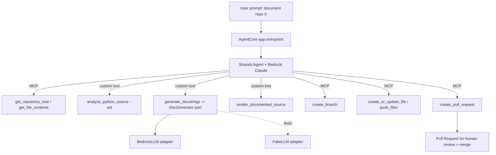

# Design — Documentation Agent

## Overview

The Documentation Agent is a layered/hexagonal Python package under `src/docagent`.
A Strands `Agent`, hosted by the Amazon Bedrock AgentCore SDK, orchestrates two
categories of tools:

1. **Custom domain tools** (`@tool`) — pure docstring analysis, generation, and
   rendering, with no direct I/O to GitHub.
2. **GitHub MCP client** — provides file-read plus branch/commit/PR tools directly
   from the remote GitHub MCP server.

The agent reads source from GitHub (fully remote), detects missing docstrings via
`ast`, generates docstrings with a Claude model on Bedrock, renders the documented
source, then creates a branch, commits, and opens a Pull Request for human review.
README generation and drift detection are added later as additional `@tool`s with
no change to existing tools or the GitHub wiring.

## Research findings (real APIs this design targets)

- **AgentCore Runtime**: `BedrockAgentCoreApp()` + async `@app.entrypoint` handler
  receiving a JSON payload (`{"prompt": str}`) over `POST /invocations`; `app.run()`
  serves it. Deploy via the `agentcore` CLI (`configure` → `launch`). The handler
  must validate `prompt` is a string before use.
- **Strands**: `Agent(model=<bedrock-model-id>, tools=[...], system_prompt=...)`
  runs the tool-calling loop against Bedrock. Custom tools are `@tool`-decorated
  functions whose docstring + type hints become the tool schema. Return structured
  results; a dict without a `status` key is treated as success, so set
  `{"status": "error"}` explicitly on failure.
- **GitHub MCP (remote)**: endpoint `https://api.githubcopilot.com/mcp/` over
  Streamable HTTP, auth `Authorization: Bearer <PAT>`. Wire as
  `MCPClient(lambda: streamablehttp_client(url, headers={...}))` and pass directly
  to `Agent(tools=[..., mcp_client])` for automatic lifecycle. Restrict tools with
  `tool_filters={"allowed": [...]}`. Relevant tools: `get_repository_tree`,
  `get_file_contents`, `create_branch`, `create_or_update_file`, `push_files`,
  `create_pull_request`.

## Architecture



## Package layout

```
src/docagent/
  domain/
    models.py        # DocKind, DocTarget, DocProposal, AnalysisReport (frozen dataclasses)
    analyzer.py      # ast scan -> AnalysisReport (missing docstrings + signatures)
    rendering.py     # insert docstrings at correct indentation; build PR title/body/branch
  ports/
    llm.py           # DocGenerator protocol: generate_docstring(target) -> Result[str, DomainError]
  adapters/
    bedrock_llm.py   # Strands/Bedrock-backed DocGenerator (prompt building + model call)
    fake_llm.py      # deterministic fake for offline tests
  tools/
    docstring_tools.py  # @tool: analyze_python_source, generate_docstrings, render_documented_source
    # future: readme_tools.py, drift_tools.py (same pattern)
  github_mcp.py    # build_github_mcp_client(pat, settings) -> MCPClient (filtered toolset)
  agent.py         # build_agent(generator, github_provider, settings) -> Strands Agent
  app.py           # BedrockAgentCoreApp + @app.entrypoint (deploy target)
  main.py          # local CLI entry (hkt-docagent)
  config/settings.py  # model id, region, repo owner/name, allowed MCP tools, PAT env var, one_pr_per_run
tests/docagent/    # pytest mirrors structure; fake LLM + fake MCP, no network/AWS
```

## Components and interfaces

### Domain models (`domain/models.py`)

Frozen dataclasses, `from __future__ import annotations`:

- `DocKind(Enum)` — `MODULE`, `CLASS`, `FUNCTION`.
- `DocTarget` — `qualified_name: str`, `kind: DocKind`, `signature: str`,
  `source_snippet: str`, `start_line: int`, `end_line: int`, `file_path: str`.
- `DocProposal` — `target: DocTarget`, `docstring: str`.
- `AnalysisReport` — `file_path: str`, `targets: list[DocTarget]`, plus counts.

### Analyzer (`domain/analyzer.py`)

- `analyze_source(source: str, file_path: str) -> Result[AnalysisReport, DomainError]`
  walks the AST for module/class/function nodes, flags those with no docstring, and
  captures signature/snippet/line range. Invalid source returns `err(...)`.

### Rendering (`domain/rendering.py`)

- `render_documented_source(source: str, proposals: list[DocProposal]) -> Result[str, DomainError]`
  inserts each docstring at the correct indentation; output must re-parse via `ast`.
- `build_pr(report, proposals) -> (branch_name, title, body)` produces a unique-ish
  branch name (e.g. `docagent/docstrings-<short-hash>`) and a body listing symbols.

### LLM port + adapters

- `ports/llm.py` — `DocGenerator` protocol:
  `generate_docstring(target: DocTarget) -> Result[str, DomainError]`.
- `adapters/fake_llm.py` — deterministic PEP 257-style docstrings (offline tests).
- `adapters/bedrock_llm.py` — Strands/Bedrock-backed generator; a pure
  prompt-builder function turns a `DocTarget` into the model prompt.

### Custom tools (`tools/docstring_tools.py`)

Strands `@tool` functions with rich docstrings (they become the schemas), each
returning structured `{"status": "success"|"error", ...}`:

- `analyze_python_source(path, source)`
- `generate_docstrings(path, source)`
- `render_documented_source(path, source)`

The `DocGenerator` is injected via a class-based tool holder so the fake and Bedrock
adapters are interchangeable.

### GitHub MCP client (`github_mcp.py`)

- `build_github_mcp_client(pat, settings) -> MCPClient` using
  `streamablehttp_client("https://api.githubcopilot.com/mcp/", headers={"Authorization": f"Bearer {pat}"})`
  and `tool_filters={"allowed": settings.allowed_github_tools}`.
- A `FakeMcpProvider` test double exposes stub GitHub tools returning canned
  responses (including a fake PR URL) so the whole flow is unit-testable offline.

### Agent (`agent.py`)

- `build_agent(generator, github_provider, settings) -> Agent` constructs
  `Agent(model=<bedrock model id>, tools=[analyze_python_source, generate_docstrings,
  render_documented_source, github_provider], system_prompt=...)`.
- System prompt enforces the flow: discover Python files → read them → analyze →
  generate docstrings → render → create branch → commit → open ONE PR (per
  `one_pr_per_run`) with a clear title/body, and never commit to the default branch.

### AgentCore entrypoint (`app.py`)

- `app = BedrockAgentCoreApp()`; `@app.entrypoint async def handler(request)`
  validates `request["prompt"]` is a string, builds the agent (Bedrock + real MCP
  from env/secret PAT), streams events; `app.run()`.

### Local CLI (`main.py`)

- `hkt-docagent` reads the PAT from env, builds the real MCP client + Bedrock
  generator + agent, and runs against the target repo.

## Data flow (happy path)

1. Agent calls `get_repository_tree` (MCP) to discover Python files.
2. For each file, `get_file_contents` (MCP) → `analyze_python_source` (custom).
3. `generate_docstrings` (custom → `DocGenerator` → Bedrock).
4. `render_documented_source` (custom) produces new file content.
5. `create_branch` (MCP) → `create_or_update_file`/`push_files` (MCP).
6. `create_pull_request` (MCP) opens the PR; human reviews and merges.

## Error handling

- Domain functions return `Result[..., DomainError]`; invalid input yields `err`.
- Custom tools translate failures into `{"status": "error", "message": ...}` and
  never raise into the agent loop.
- The AgentCore entrypoint rejects non-string prompts with a clear error.

## Testing strategy

- Tasks 1–7 are fully offline: fake LLM + fake MCP provider, no network/AWS.
- Domain logic (analyzer, rendering) verified by re-parsing rendered output with
  `ast` and asserting docstrings are present and correctly indented.
- Tools tested by direct invocation with the fake generator.
- Agent assembly tested by asserting registered tools and system prompt (no live
  model call).
- Live Bedrock/GitHub calls guarded behind integration tests requiring
  credentials/PAT.

## Security

- PAT via env var / secret; never hardcoded or logged. Least-privilege `repo` scope.
- Restrict GitHub MCP toolset via `tool_filters`.
- Least-privilege IAM policy for Bedrock model invocation.
- Agent never writes to the default branch; the PR is the approval boundary.
